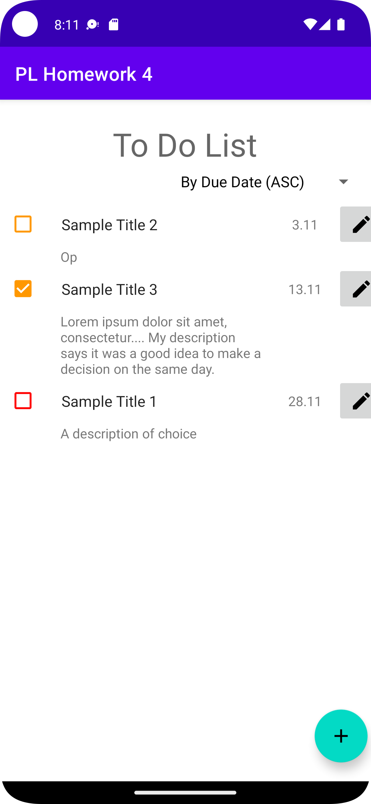

# Task Manager in Kotlin
## PL Homework 4 + 5
### Martins P, BITL4

This is an experiment of creating a todo list/task manager for an Android using Kotlin.

All mandatory requirements were implemented - it is possible to see, create, edit and delete tasks. It is also possible to sort the tasks by different criteria, and they are preserved between application runs.
On this branch, all application data is stored using SQL.

All work is mine, except where it was fundamentally necessary to acknowledge the source or influence of the code. Such mentions are added as comments to the corresponding code parts. It was build on Basic Activity Android Studio provided.

